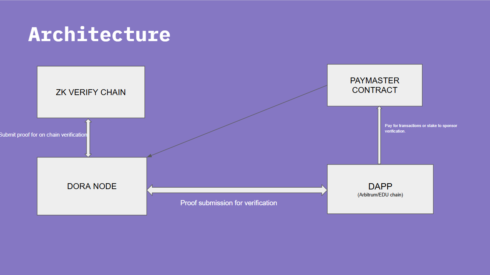
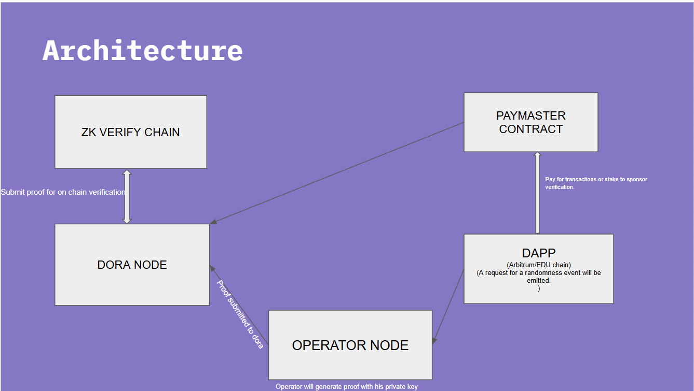
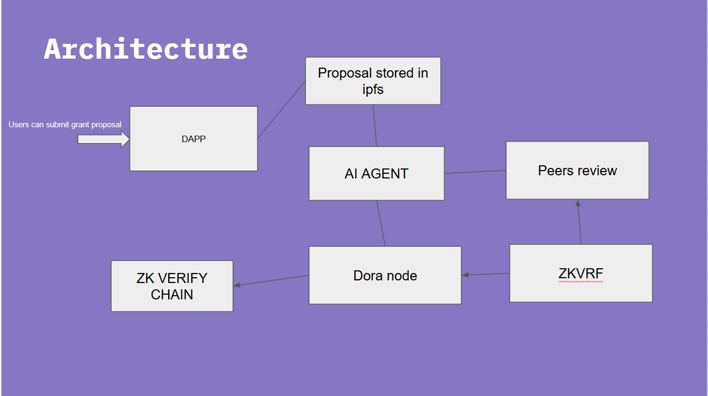

## Demo Video
[Watch Demo Video](https://youtu.be/tQPaPGo0pyA)

## Explanation Video
[Watch Explanation Video](https://youtu.be/3EEa9kmQEhg)

# 🚀 DoraNode

A revolutionary platform simplifying ZK proof verification by enabling native token payments and automated cross-chain verification.

## Overview
DoraNode is a decentralized service that simplifies **zero-knowledge proof (ZKP) verification** on the **ZKVerify Chain**. It enables users to generate ZK proofs and submit them for verification without needing a dedicated ZKVerify-supported wallet or ACME gas tokens.

When I started building for the zkVerify hackathon, I had a vision: blockchain is a technology with the potential to create massive societal change. However, for this transformation to happen, blockchain must be accessible to everyone, without borders.  

Currently, the majority of people in the blockchain space have a technical background, and that needs to change. Blockchain should be in everyone's hands.  

With this in mind, I designed DoraNode to remove the complexity. We eliminate the abstract layers so that everything happens in the background—users don’t need to worry about the technical details. They simply generate a proof, and DoraNode handles the rest.

## 🌟 Features

- **Native Token Payments**: Pay verification fees in your chain's native tokens
- **Paymaster Contract**: Enables dApp sponsorship of verification costs
- **No Wallet Switching**: Seamless cross-chain verification
- **AI Integration**: Automated proposal review and bias detection
- **ZKVRF Implementation**: Fair and verifiable random selection

#  DoraNode Architecture


## DoraNode Architecture  

### Overview  
DoraNode is designed with a simple architecture to ensure ease of integration.  

### Key Components  
- **Runs on Docker** – DoraNode operates within a Docker container, using port **4339**.  
- **Proof Submission** – dApps send proof data to DoraNode for verification.  
- **ZKVerify Integration** – Submitted proofs are forwarded to the ZKVerify chain for validation.  
- **Response Handling** – Once verification is complete, DoraNode returns the transaction details to the requester.  

### Example Proof Submission (Using Axios)  
```javascript
const axios = require('axios');

// Define the DoraNode service port
const doraNodePort = 4339;

// Define the request payload
const data = {
    vkey: "",
    proof: "",
    pubsignal: [],
};

// Send the POST request
axios.post(`http://localhost:${doraNodePort}/verify`, data)
    .then(response => {
        console.log(response.data);
    })
    .catch(error => {
        console.error("Error:", error.response ? error.response.data : error.message);
    });
```

This example demonstrates how dApps can interact with DoraNode by sending proof data for verification. currenlty only supports ultraplonk.(more coming soon.....)
<br>
## ZKVRF Architecture  


## ⚠️  Note
>  ZKVRF is a Verifiable Random Function (VRF) project re-implemented in Circom and Noir for zkVerify. Additionally, an automated operator node has been implemented.

### Workflow  

1. **VRF Proof Generation**  
   - The Operator Node generates a VRF proof based on incoming requests.  
   - The proof is then sent to DoraNode for verification.  

2. **Randomness Request Event**  
   - When randomness is requested on-chain, an event is emitted:  
   ```solidity
   event RandomnessRequested(
       uint256 indexed requestId,
       bytes32 indexed operatorPublicKey,
       address indexed requester,
       uint16 minBlockConfirmations,
       uint32 callbackGasLimit,
       uint256 nonce
   );
   ```  

3. **Fetching Requests**  
   - The Operator Node queries the Subgraph Node every **5 seconds** to fetch new randomness requests.  

4. **Randomness Fulfillment**  
   - Once the request is fulfilled and randomness is generated, an event is triggered:  
   ```solidity
   event RandomnessFulfilled(
       uint256 indexed requestId,
       bytes32 indexed operatorPublicKey,
       address indexed requester,
       uint256 nonce,
       uint256 randomness
   );
   ```  

This ensures a seamless process where the Operator Node continuously listens for randomness requests, generates VRF proofs, and submits them for verification.
## Key Features

### Secure Randomness Properties

- **Unpredictability**: Random numbers cannot be guessed in advance
- **Impartiality**: Results are generated without bias
- **Auditability**: The random number generation process is fully verifiable
- **Consistency**: Reliable availability when needed

### Technical Advantages

- **Universal Access**: Generate random numbers directly through a web browser
- **No Special Software**: Works with standard web browsers

## Benefits

ZKRand addresses the common trade-offs found in current randomness technologies by providing a balanced solution that optimizes:

- Availability
- Cost efficiency
- Bias resistance
- System uptime

# ZKVRF-Based Fair Grant Selection Architecture


### AI Integration  
- **AI Model Used** – Meta Llama 3.1 8B Instruct Turbo powers the selection process.  
- **Chatbot Integration** – A chatbot is embedded in the frontend to assist users with zkVerify-related queries.  
- **Crypto Price Feed** – Integrated into the chatbot for demonstration purposes.  

### Grant Proposal Evaluation  
1. **Proposal Submission**  
   - All grant proposals are stored on **IPFS** using **Pinata**.  

2. **Proposal Review Process**  
   - After the proposal period ends, each grant is evaluated by:  
     - An **AI Agent** (for initial assessment).  
     - A **Peer Review Process** based on **zkVRF** for fair and unbiased selection.  

This approach ensures transparency, decentralization, and an AI-driven evaluation process for zkVRF-based grant selection.

<br><br>

# DoraNode and Operator Node Setup using Docker

This guide provides step-by-step instructions for running **DoraNode** and **Operator Node** using Docker. Docker simplifies the setup process by containerizing the environment, ensuring consistency across different systems.

---

## Prerequisites

Before proceeding, ensure you have the following installed on your system:

1. **Docker**: Install Docker by following the official installation guide for your operating system:
   - [Docker Installation Guide](https://docs.docker.com/get-docker/)
   
2. **Docker Compose**: Docker Compose is typically included with Docker Desktop. If not, install it separately:
   - [Docker Compose Installation Guide](https://docs.docker.com/compose/install/)

3. **Git**: Clone this repository to your local machine:
   - [Git Installation Guide](https://git-scm.com/book/en/v2/Getting-Started-Installing-Git)

---

## Setup Instructions


---

### 1. Navigate to the Docker Directory
Change to the `docker` directory where the `docker-compose.yml` file is located:

```bash
cd docker
```

---

### 2. Run Docker Compose
Use Docker Compose to start the DoraNode and Operator Node in detached mode. This will run the containers in the background:

```bash
docker compose up -d
```

#### Explanation:
- `docker compose up`: Starts the containers defined in the `docker-compose.yml` file.
- `-d`: Runs the containers in **detached mode**, meaning they will run in the background.

---

### 3. Verify the Containers are Running
To check the status of the running containers, use the following command:

```bash
docker ps
```

This will display a list of running containers. Ensure that both the DoraNode and Operator Node containers are listed and running.

---

### 4. View Logs (Optional)
If you need to debug or monitor the nodes, you can view the logs for each container:

```bash
docker logs <container-name>
```

Replace `<container-name>` with the name of the container (e.g., `doranode` or `operator-node`).

---

### 6. Stop the Containers
To stop the running containers, use the following command:

```bash
docker compose down
```

This will stop and remove the containers, but it will retain any data stored in volumes.

---


## Setting Up the Frontend
To set up and run the frontend, follow these steps:

1. Navigate to the `Frontend` directory:
   ```sh
   cd Frontend
   ```

2. Install dependencies:
   ```sh
   npm install
   ```

3. Start the development server:
   ```sh
   npm run dev
   ```

   This will start the frontend on the default development port (usually `http://localhost:3000/` or as specified in your configuration).

## Additional Notes
- If you encounter issues, ensure your Node.js and npm versions are up to date.
- If using a specific framework (e.g., React, Vue, Next.js), mention any extra configuration steps required.
- Consider adding environment variable setup instructions if applicable.

# Proofs and Deployment Address

[ZkVerify(all proof verification details)](https://zkverify-explorer.zkverify.io/accounts/xpistKg5cTuaNjMvtwvAJN8hS84i8sgpmHKREdDNGB5DdfqpP?tab=extrinsics&page=1)

## Arbitrum 

[paymaster](https://sepolia.arbiscan.io/address/0x5f243bdac11c59217904f25fd604496b7d7bd438)
[VRF](https://sepolia.arbiscan.io/address/0xb55b86e70e3c510528dca6a7b061133bd310e780)


## EDU Chain

[paymaster](https://edu-chain-testnet.blockscout.com/address/0x57949402c712f2eeeaebadb47a9af7ce4af1f267)
[VRF](https://edu-chain-testnet.blockscout.com/address/0xfBcD95F3E59c60E1706C7655c2b30a504ec84589)


